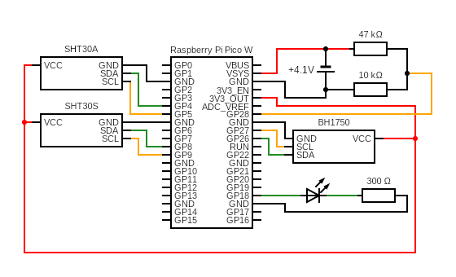
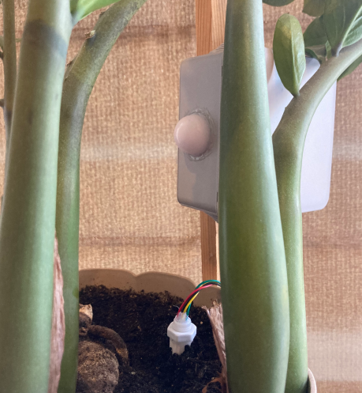
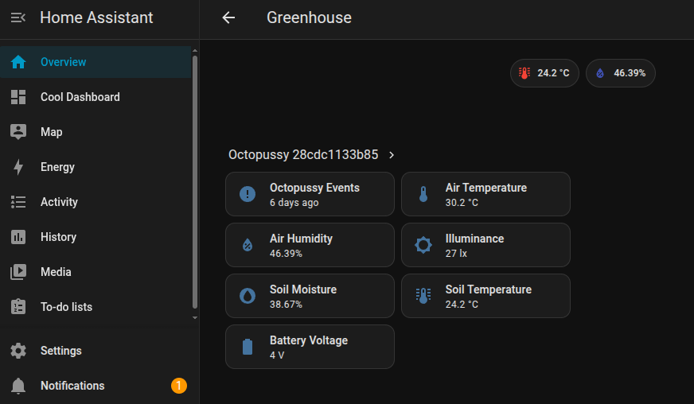
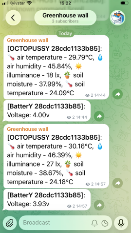

# Octopussy - smart sensor for agriculture

**Octopussy** is an advanced, multi-legged, open-source smart sensor designed for precision agriculture. It continuously monitors environmental conditions such as **temperature, humidity, soil moisture, and illuminance** in your yard, greenhouse, or farm field, and reports the collected data through **Telegram** or **Home Assistant**.

As an AI-powered feature, **GooglA**, based on requests to the online **Gemini AI** service, analyzes the sensor data and helps determine whether irrigation is needed. The device uses **802.11g Wi-Fi 3** for wireless communication and features an integrated **Analog-to-Digital Converter (ADC)** for intelligent battery-level monitoring and notifications.

The device is built around a **Raspberry Pi Pico W** microcontroller with *MicroPython* on board and is powered by an **18650 battery**, providing up to **two months of autonomous operation** in light-sleep mode. It is equipped with several sensors, including the **SHT30** for temperature and humidity/soil moisture monitoring and the **BH1750** for illuminance measurement.

## Features

**Octopussy** is an AI-powered device using **Gemini AI**, with **Telegram** and **Home Assistant** integration, along with the following features:

- **Environmental monitoring** — temperature and humidity using SHT30
- **Soil monitoring** — soil temperature and moisture using an SHT30 sensor in a protective capsule
- **Illuminance monitoring** — using BH1750
- **AI-assisted irrigation** — Gemini AI analyzes sensor data and helps determine whether watering is needed
- **Telegram integration** — for reporting sensor data and notifications
- **Home Assistant integration** — for real-time monitoring and automation
- **Battery monitoring** — ADC-based battery-level measurement and notifications
- **Wi-Fi connectivity** — 802.11g Wi-Fi 3
- **Low-power operation** — up to 2 months of battery life using a single 18650 cell in light-sleep mode
- **MicroPython firmware** — lightweight and easy to customize
- **Open source** — designed for experimentation, customization, and smart-agriculture projects.

## Schema and components
Let’s have a look at the pinout schematic and the components connected to the *Raspberry Pi Pico W* microcontroller. The schematic shows how the sensors, battery monitoring circuit, and status LED are connected to the controller.



Pinout schema for the *Raspberry Pi Pico W* (**Octopussy**) and its connected components.

| RP Pico W Pin | Component Pin | Component | Description |
| :------------ | :------------ | :--------- | :---------- |
| `GPIO 4` | `SDA` | SHT30A | Air temperature/humidity sensor |
| `GPIO 5` | `SCL` | SHT30A | Air temperature/humidity sensor |
| `GPIO 8` | `SDA` | SHT30S | Soil temperature/moisture sensor |
| `GPIO 9` | `SCL` | SHT30S | Soil temperature/moisture sensor |
| `GPIO 26` | `SDA` | BH1750 | Illuminance sensor |
| `GPIO 27` | `SCL` | BH1750 | Illuminance sensor |
| `GPIO 28` | - | Battery voltage divider | Battery voltage measurement |
| `GPIO 18` | `LED` | Status LED | Network/status indication |
| `VSYS` | - | Battery | ~4.1v power supply |
| `3V3_OUT` | - | SHT30S/SH30A, BH1750 | 3.3v power supply |
| `GND` | `GND` | All components | Common ground |

As shown in the table above, all three sensors are connected to their respective I2C bus, with `I2C port 0` switched programmatically. One ADC input is used for battery voltage monitoring, while `GPIO 18` controls the status LED, indicating Wi-Fi connection and sensor data transmission to `Telegram/Home Assistant`. All sensors are powered from the `3V3_OUT` pin, while the controller is powered by a single `18650 Li-ion` battery.

## Configuration
To configure a device, upload files from this repository, including `main.py` and `definitions.py`, to the microcontroller using the **Visual Studio Code MicroPico vREPL extension** or another suitable development tool and setup vailuble parameters.

### GPIO configuration
  ```python
  ### GPIO CONFIGURATION
  NETWORK_LED_PIN = 18

  SHT30S_SDA_PIN = 8
  SHT30S_SCL_PIN = 9
  SHT30A_SDA_PIN = 4
  SHT30A_SCL_PIN = 5
  BH1750_SDA_PIN = 26
  BH1750_SCL_PIN = 27

  SHT30_I2C_PORT = 0
  BH1750_I2C_PORT = 1

  ADC_PIN = 28
  LOW_BATTERY = 3.5 # 3.5V
  BATTERY_NEEDS_REPORT = True

  ### DEVICE
  DEVICE_UPDATES_TIMEOUT_MS = 60000 * 120 # 120min (2h)
  DEVICE_LIGHTSLEEP_TIMEOUT_MS = 60000 * 30 # 30min, max - 1h
  ```
The GPIO configuration defines the pins used for the network LED, SHT30 and BH1750 sensors, and battery voltage monitoring via ADC. The network LED indicates that the device is active while connecting to Wi-Fi, Gemini API, Home Assistant, or Telegram.

`DEVICE_UPDATES_TIMEOUT_MS` defines the device update interval. The device reports sensor data to Telegram or Home Assistant at each update interval.

`DEVICE_LIGHTSLEEP_TIMEOUT_MS` defines how long the device remains in light-sleep mode between updates. Due to hardware limitations of the internal timers on the Raspberry Pi Pico W, this value must not exceed **1 hour**.

`BATTERY_NEEDS_REPORT = True` enables battery-level reporting to Telegram or Home Assistant. If set to `False`, the device will not report its battery level.

`LOW_BATTERY = 3.5` sets the low-battery threshold to **3.5V**. When the battery voltage reaches this level, the device sends a *low-battery notification* before shutting down.

### Telegram bot setup
The **Octopussy** device, located in the greenhouse, uses **Telegram** to send notifications about the current sensor status, including humidity, temperature, and other measurements. To configure Telegram integration, you will need to:

1. Message `@BotFather` on Telegram, create a new bot, and copy its **Bot Token**.
2. Create a Telegram channel, add your bot as an administrator, and obtain the **Channel ID**.

### Wi-Fi and Telegram configuration
Configure `definitions.py` on the **Octopussy device** with your farmhouse Wi-Fi and Telegram credentials:
   ```python
   WIFI_CLIENT_HOSTNAME = "OCTOPUSSY-HOST-NAME"
   WIFI_NETWORK_NAME = "FARMHOUSE_WIFI_ROUTER_SSID"
   WIFI_NETWORK_PASSWORD = "FARMHOUSE_WIFI_ROUTER_PASSWORD"
   WIFI_CONNECTION_TIMEOUT = 15000

   TELEGRAM_HOST = "api.telegram.org"
   TELEGRAM_BOT_ID = "bot0000000000:XXX_xXXXXXXXXXXXXXX-XXXXXXXX"  # Your bot token
   TELEGRAM_CHAT_ID = "-1001111111112"  # Your Telegram channel ID
   TELEGRAM_NEEDS_REPORT = True
   ```
`WIFI_CONNECTION_TIMEOUT = 15000` sets the Wi-Fi connection timeout to **15 seconds**.

Set `TELEGRAM_NEEDS_REPORT` to enable or disable Telegram notifications. 

Adjust the remaining parameters according to your setup.

### Home Assistant MQTT configuration
**Octopussy** device uses MQTT broker to communicate with Home Assistant (HA). Configure the MQTT credentials used by **Octopussy** to connect to the Home Assistant MQTT broker accordengly to your settings.
  ```python
  ### MQTT Home Assistant
  MQTT_USER = "mqtt_user"
  MQTT_PASSWORD = "mqtt_password"
  MQTT_NEEDS_REPORT = False
  ```
Set `MQTT_NEEDS_REPORT` to `True` to enable MQTT reporting or `False` to disable it.

### Gemini AI configuration
Configure the **Gemini AI API key**, model, endpoint, and prompt used by **Octopussy** to analyze greenhouse conditions and determine whether irrigation is needed.
  ```python
  ### Gemini AI
  GEMINI_API_KEY = "Your_Gemini_API_KEY_from_Google_AI_Studio"
  GEMINI_PROMPT_TEMPLATE = (
      "You are a greenhouse tomato expert. Analyze these five current metrics: "
      "Air Temp: {0}°C, Humidity: {1}%, Light: {2}lx, Soil Moisture: {3}%, Soil Temp: {4}°C. "
      "You must respond in one part output ONLY one of the two following options: "
      "If watering is needed, output exactly: 'needs watering - [Volume]L'. "
      "If watering is not needed, output exactly: 'no watering needed.'"
  )
  GEMINI_MODEL_NAME = "gemini-3.5-flash-lite"
  GEMINI_ENDPOINT_URL = f"https://generativelanguage.googleapis.com/v1beta/models/{GEMINI_MODEL_NAME}:generateContent"
  GEMINI_NEEDS_RESOLUTION = False
  ```
Parameter `GEMINI_PROMPT_TEMPLATE` - defines the prompt and response format used to analyze greenhouse conditions and determine irrigation needs.

Parameter `GEMINI_MODEL_NAME` - specifies the Gemini AI model used for analysis.

Parameter `GEMINI_ENDPOINT_URL` - defines the Google Gemini API endpoint used to send requests to the selected model.

Set `GEMINI_NEEDS_RESOLUTION` to `True` to enable AI-based irrigation analysis and optionally report the results to **Telegram** or **Home Assistant**, if they are configured properly above.

## How to use

The **Octopussy** device is very easy to use. To get started, you just need to:

1. Set the configuration parameters as described above.
2. Insert a `18650 battery` and make sure the LED is blinking, indicating that the device is attempting to connect to your farmhouse Wi-Fi network.
3. Place the `SHT30S sensor capsule` into the soil and secure the device to prevent water from reaching the electronics.

<table>
  <tr>
    <td rowspan="2">
      <a href="assets/octopussy_device.png">
        
      </a>
    </td>
    <td>
      <a href="assets/octopussy_ha.png">
        
      </a>
    </td>
  </tr>
  <tr>
    <td>
      <a href="assets/octopussy_telegaw.png">
        
      </a>
    </td>
  </tr>
</table>

Depending on which features are enabled, you will start receiving sensor data through the configured **Telegram** or **Home Assistant** integration.

In case of any issues, troubleshoot the device step by step by disabling individual features to identify the source of the problem. Connect the **Octopussy** device to your computer via USB and use one of the available debugging environments, such as the **MicroPico vREPL** extension for **Visual Studio Code**.

## Get in touch
If you have any specific questions, feel free to reach out to me on Twitter: https://twitter.com/dmytro_sazonov